# Procedimiento de Instalacion de Git

En este markdown se encontrar el paso a paso de la descarga e instalacion de git y de los primeros pasos en este mismo

## Descarga de Git

Puedes utilizar este [link](https://git-scm.com/) para poder ir a la pagina de `Git` y descargarlo

Nos cargara la pgian en el cual debemos que darle click en `Install for Windows` en el cual nos enviara a otra pagina

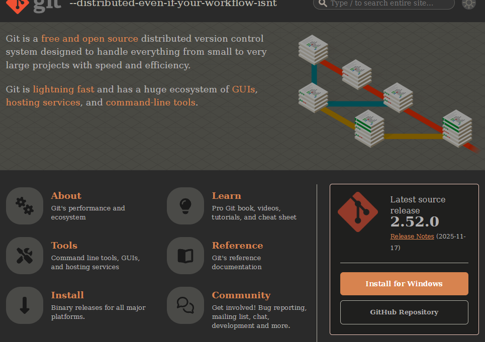 

Estando en la pagina de descarga deberemos slecionar cual es la mejo opcion para nuestro equipo de computo, lo mas recomendable sera la que dice `Git for Windows/x64 Setup.` ya que es la version estandar.

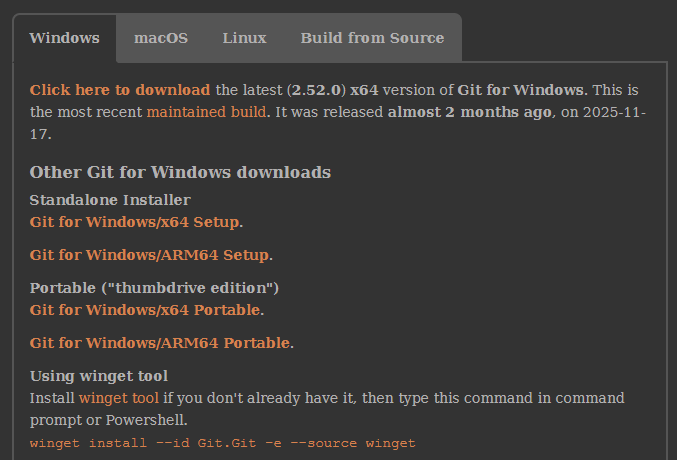

## Instalacion de Git
Ya descargado el Programa ahora toca instalar Git con los siguientes pasos para dejarlo lo mas funcional posible 

Nos pedira que le demos permisos para que realice cambios en nuestro dispositivo a lo cual nosotros le daremos que si 

Ya al iniciaer la intalacion nos parecera los permisos deramos next, despues nos dira en que carpeta se guardara lo que es el Git

Seguiremos dandole next hasta que aparesca la siguiente ventana:

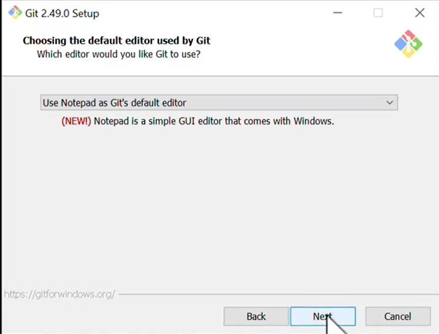

Apartir de esta ventan se mostrar que cuales son los requrimientos qu debemos seleccionar para tener una buana instalacon de Git


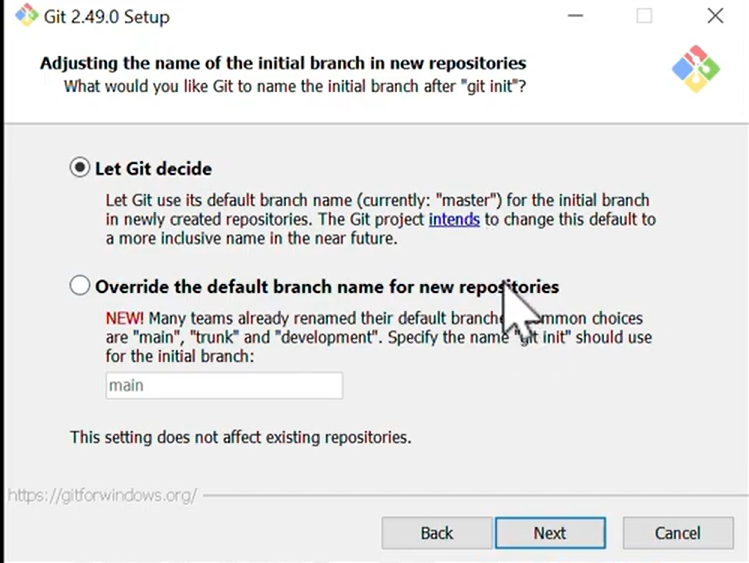

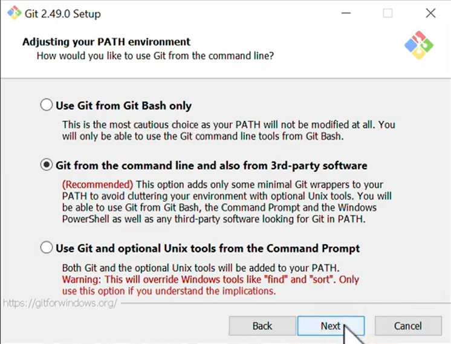

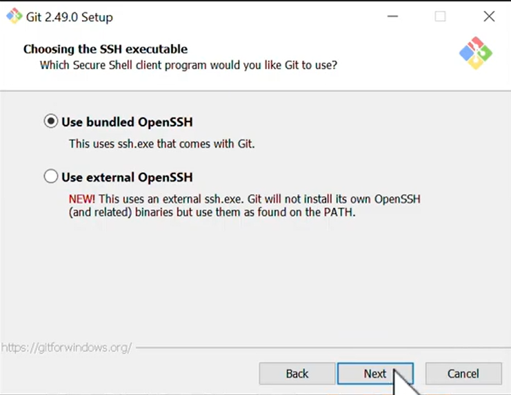

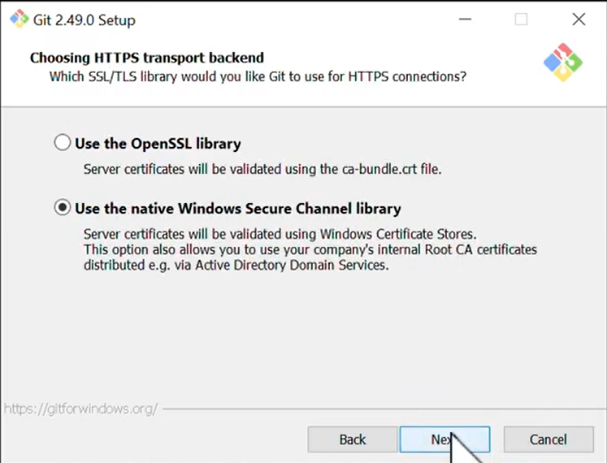

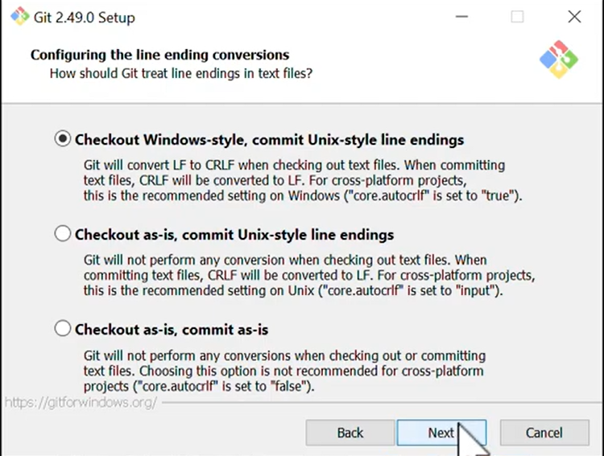

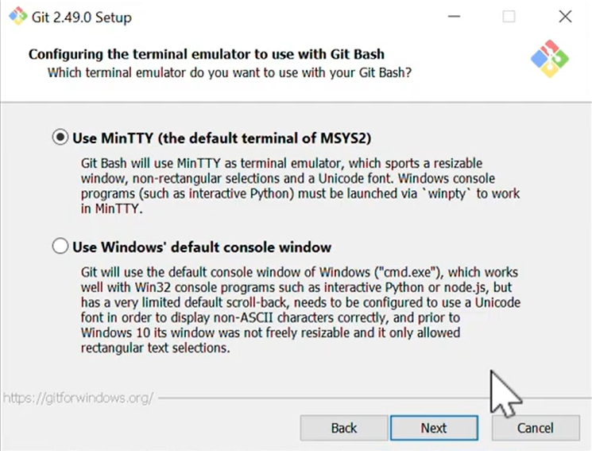

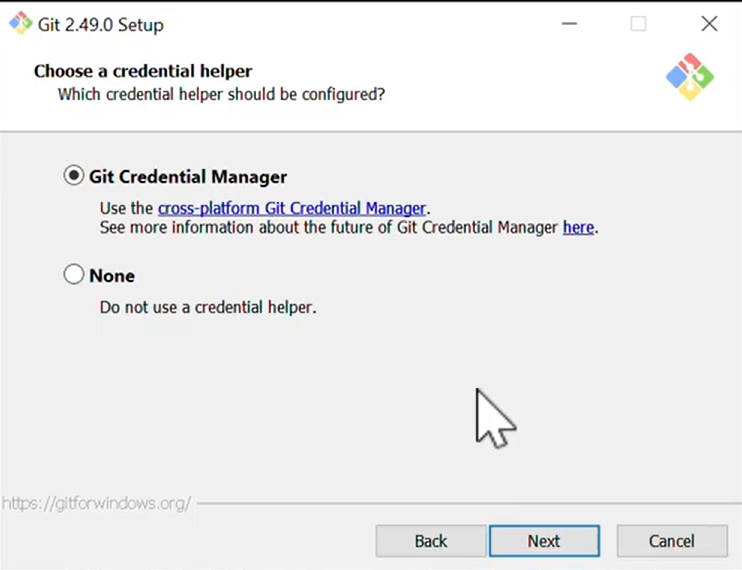

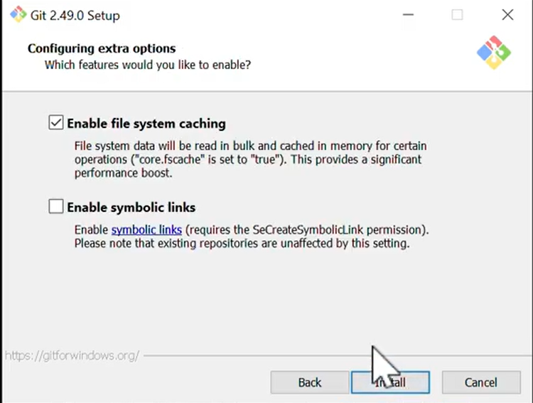


## Primeros pasos

Ya despues de intalar lo que es Git ahodaremos la configuracion rapida par que podamos ocuparlo y mas adelante el poder subir los reporsitorios en git hub o realizar comandos mas rapidos 

A parte de la configuracion rapida daremos comandos con su descripcion en el cual te serviran la primra vez que ocupes git y puedas recordar 

### Primeros comandos de GIT

|  Comando                              | Descripcion |
|---------------------------------------|-----------------------------|
|git –version                           |Muestra la versión de GIT|
|git help                               |Muestra la ayuda de GIT |
|git help commit                        |Muestra ayuda sobre el comando |
|git config --global user.name “usuario”| Configura de forma global el usuario |
|git config  --global user.email “correo”|Establece de forma global el correo |
|git config --global core.editor “code  -- wait”|Establece como editor predeterminado a git visual studio code |
|git config --global -e                 |Lista todas las configuraciones globales|


### Primer Reporsitorio

|  Comando                              | Descripcion |
|---------------------------------------|-----------------------------|
|git init                               |Inicializa el repositorio|
|git branch -m master main              |Cambia el nombre de la rama, en este caso la rama master a main|
|git config –global init.DefaultBranch main| Cambia el nombre de la rama de manera global|
|ls -a                                  | Visualiza los archivos ocultos como .git |
|git status| Da información sobre los commits, la rama en la que se esta trabajando |

Con estos comandos podemos iniciar a realizar los primeros pasos y el primer repositorio en Git y Git Hub

Deberemos que verificar que este intaladao Git asi que deberemos que hacerlo con el comando:

``` git bash
git --versio
```

Despeues de Verificar debemos que usuar un Usuario en el cual este se va a mostrar por quien esta trabajado el repositorio , ai tambien deberemos que establecer un correo que ocupes normalmente por que este nos ayudara crear nuestra cuenta de GitHub, se tendra que ver de la siguiente manera(deberean escribir bien los comando si no los dejara avansar)

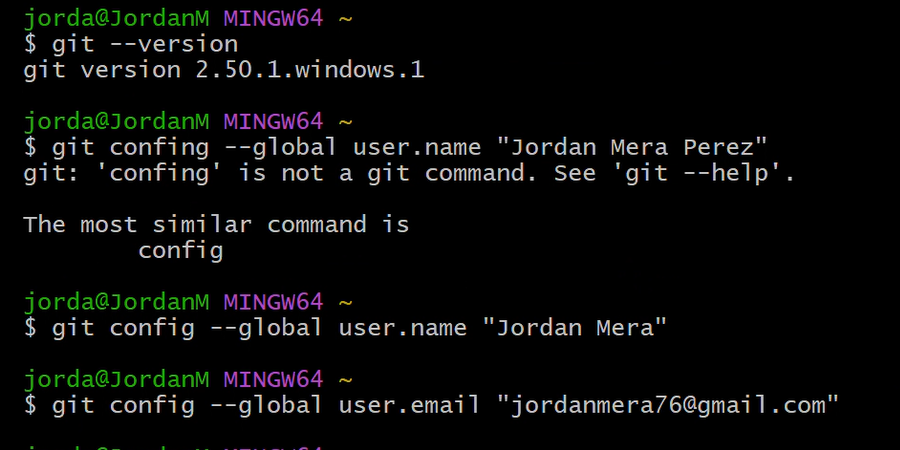

Ya que hicimos lo anterior podremos hacer el repocitorio de manera local, deberemos estar hubicados en la carpeta que haremos el repositorio

Ya estando en la carpeta que trabajaremos podemos utilizar el comando `ls` para verificar que esten todos los archivos que queremos trabajar

Con el comando `git init` estaremos iniciando el repoditorio de manera local y como sabremos por que nos saldra la leyenda iniado repocitorio y a lado de la hubicacion de la carpeta dira `Main` como se muestra en la siguiente imagen

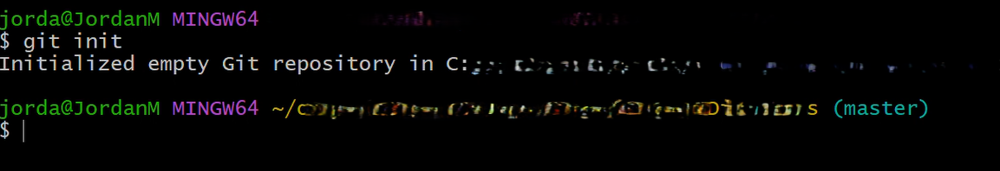

En caso de que a ustedes le salga `Mater` como a mi debemos que ponerlo en main ya que master es un termino obsoleto , asi que ocuparemos el siguiente comando

``` git bash
git branch -m master main 
```
Asi ya veremos que se cambia de `Master` a `Main` 

Para darle un plus, si vamos a ocupar esta carpeta constantemente y se va estar actualizando lo mas recomendable es ocupar:

```git bash
git config --global init.DefaultBranch main
```
Esto nos ayudara que cada vez que no estemos iniciando a cada rato que queramos trabajra con este repositorio 

Y como sabremos que esta iniciado correactamente? lo mostraremo con el comando 

```git bash
ls -a
```
este nos ayudara que muestre carpetas ocultas y una de las carpetas ocultas es la carpeta `Git`, si esta carpeta aparece es por que se inico bien el reporcitorio 

Asi es como se inia un repocitorio de manera local 

## Subir nuestro repociotrio a GitHub

Esta es la ultima parte para que sepamos com subir nuestro repositorio de una manera local a una virtual o en este caso en la nuve que seria en GitHub

Ya estando en nuestro carpeta con el con el apartado `Main` ocuparemos el codigo:

``` git bash
git status 
```
Esto nos dira el estatus que esta nuestro archivos en este caso apareceran en rojo por que los documentos aun no han sido subidos a git , solamente esta echo el repositorio asi ocuparemos el siguiente comadno:

```git bash
git add .
```
Este comado nos ayuda a greagar todas carpetas y archivos a Git y los prepara para poder subir a GitHub y como sabremso que se hizo bien , en lugar de rojo sera de color Verde

Ahora deberemos que nombrar nuestro repositorio con el siguiente comando:

``` git bash
git commit -m "Nombre del repositorio"
```
Asi nombraremos nuestro repositorio a la misma manera estaremos acabando el proceso de realizar nuestro repositorio completo en git ya solo faltaria subirlo a GitHub

Hora iremos a [GitHub](https://github.com/login) en cual crearemos nuestra cuenta en el cual lo aremos con el correo que ocupamos al al iniciar Git en el punto [Primeros Pasos](#primeros-pasos), en caso de no recordar podemos ocupar el siguiente comando:

``` git bash
git log
```
Que nos aparecera El autor que contiene el nombre y el corre y tambien la fecha y hora en que el repositorio se subio a Git

Ya echa nuestra cuenta tendremos que ir a nuestro `Perfi` en la parte de `Repositorio` ya estando ahi nos dara una pagia vacia asi que buscaremos el boton  |`Nuevo` para subir nuestro repositorio

Nospedira que nombremos nuestro repositorio en GitHub y una pequeña Descripcion y lo demas se quedara igual, le damos `crear repositorio`

Nos cargara otra pagina de con varios comandos una de `configuracion rapida` otra de `crear un nuevo repositorio en la linea de comandos` o `enviar un repositorioexistente desde la linea de comando`

Nosotros nos enfocaremos en el ultimo ya que sosmos nuevo pero ya tenemos echo un repositorio , ocupaemos el siguiente comado para establecer conexion desde Git a GitHub:

```git bash
git remote add origin https//link que les haya arojado .git 
```
Para verificar que etemos bien ocuparemos 

```git bash
git remote -v
```
Nos saldra dos URL en el cual son los mismo solo que uno dira `fetch` y otro `push` esto podremos ocupar cuadno actualisemos o descargemos nuestro repositorio 

Ya para terminar y subir nuestro primer repositorio deberemos que ocupar el siguiente comadno :

``` git bash
git push -u origin main
```

Ya con este nos saldra una venta en el cual nos pedira iniciar cesion para Git se conecte con GitHub y ya pueda parecer nuestro repositorio en GutHub

ya haciendo esto podemos repertirlo una y otra vez para crear repositroios en git y subirlos a GitHub

