# Instalacion de SQL Management

Ente este markdown describiremos el paos a paso de como intalaremos el SQL Management en nuestro computo 

En nuestro buscador escribiremos SQL Management y en la primera opcion le daremos click y nos llecara a ala descarga o tambien puede dar click [aqui](https://learn.microsoft.com/en-us/ssms/install/install) que igual te llevara al instalador

Ya que se descargo el instalador lo buscaremos en donde este descargado le daremos clik derecho para y lo ejecutaremos como admintrador y le daremos el permido para relaizar cambios en nuestra computadora

Acontinucaion nos aprecera esta ventana con tres opcionnosotros le daremos a la ultima opcion que es `Descargaer medios` 

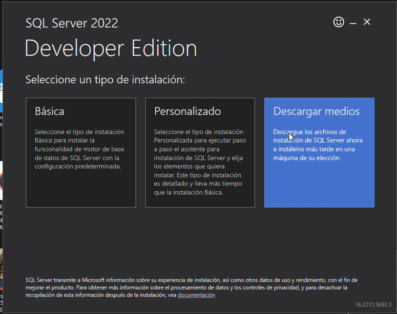

En la siguiente parte para descargar dejaremos la opcion ISO esto se refiere aun disco virtual , est disco virtual contiene los drivers para poder intalarel programa que estaremos ocupando, en el idioma selecionaremos el ingles ya que si selccionamos el español el software no reconocera el español Latinomericano y tendremos que hacer un ajsutes en nuestra computadora para ponerlo en Español españa A si que lo dejaremos en ingles y sera de la siguiente manera como se muetra en la imagen 

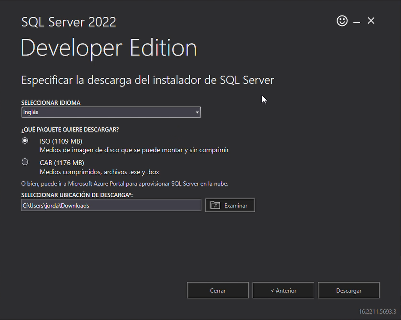

Echo lo anterior, revisando tambien la hubicacion de donde estara hubicado la descarga le daremos `Descargar` y esperaremos unos minutos a que se desacrgue la ISO

Ya descargado nos arrojara como si fuera un documento blanco pero no se preocupen es parte del proceso ya que la computadora no tiene el rpograma necesario para instalar ISO en este caso lo que vamos hacer es darle clik derecho al archivo descargado, selecionar `abrir con...` y selecionaremos el `explorador de archivos` 

Esto abrira el explorador de archivos en el cual contiene todo lo que ocupa la ISO, asi que buscaremos la aplicacion que diga `Setup` y le daremos los permisos necesarios para poder ejecutarse 

Acontinuacion nos abrira una ventana como se muestra abajo de este texto, en el cual buscaremos en el menu que esta de lado izquierdo el apartado `Installation`

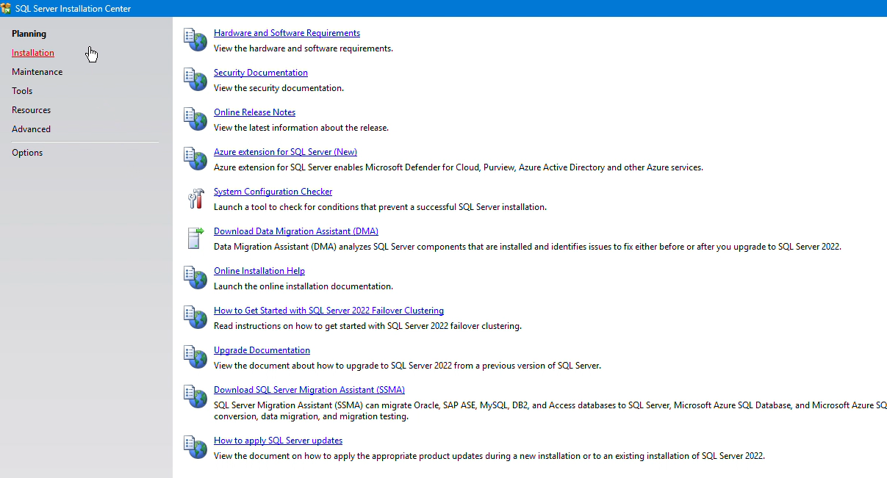

Estando en el apartado `Installation` ahora selecionaremos la primera Opcion que seria `New SQL Server standlone installation or... ` y nos abrira la siguiente ventana

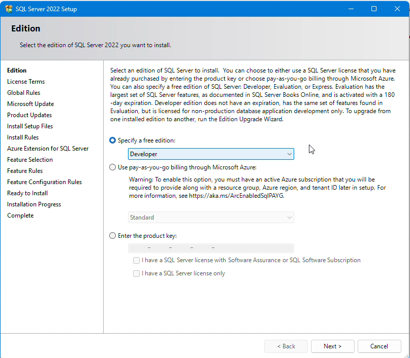

Dejaremos como biene la configuracion y le damos seguir, despues aceptaremos los terminos de la licencia y le daremos seguir 

En la siguunete ventana nos enseñara un panel en cual cual se tendra que ver igual que la imagen que etsa abajo, en vaso que este bien le damos `Next`, en caso de que aparece diferente algo se hizo mal al anterior o tu equipo no esta respondiendo de la manera adecuada

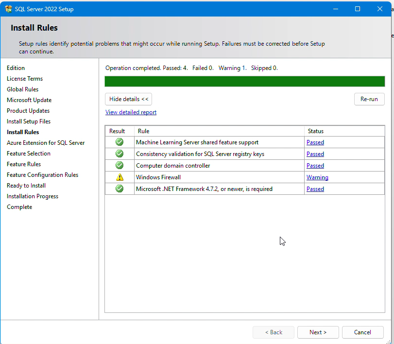

Acontinuacion se mostrara por medio de imagenes como deben de ser las confighuraciones para esta intalcion

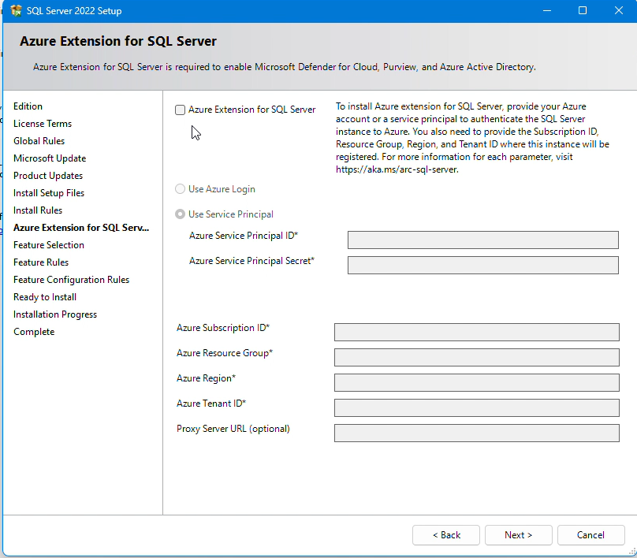

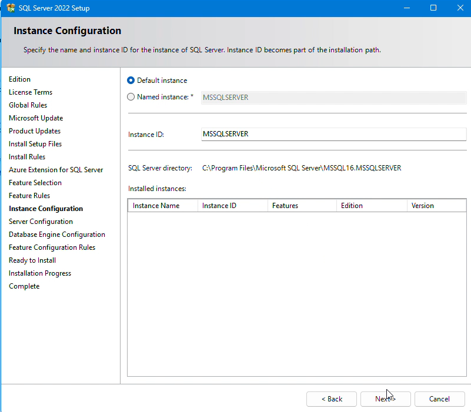

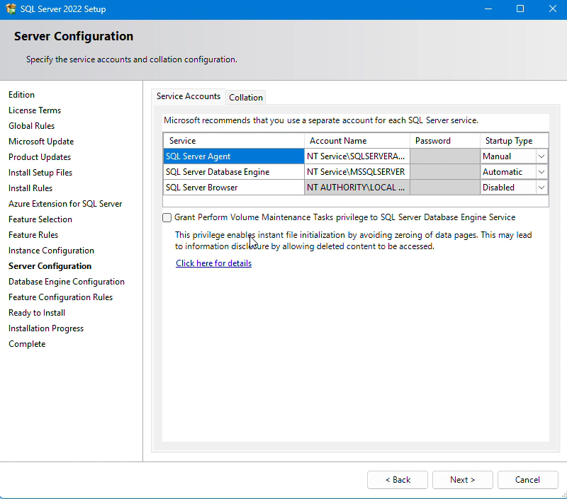

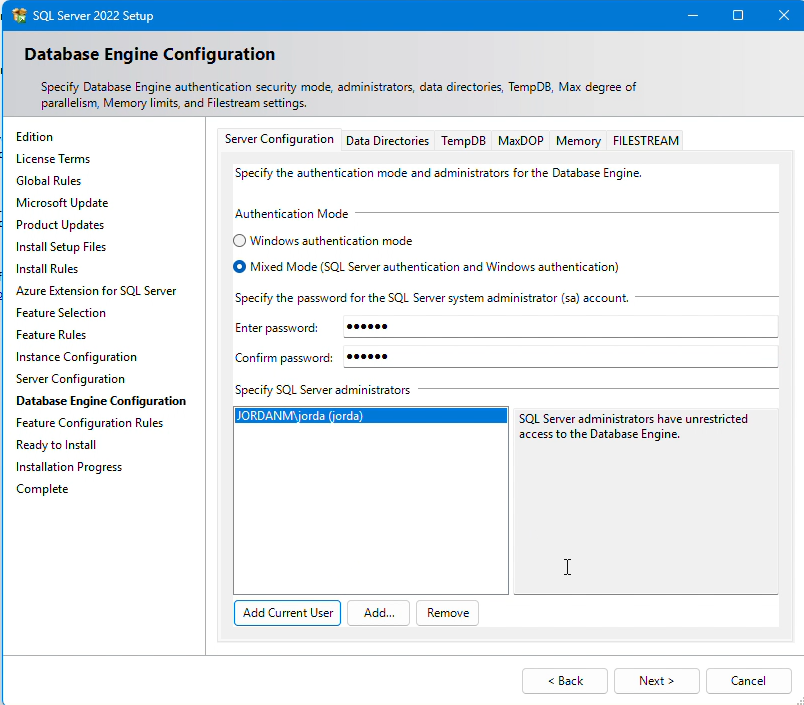

Como se muestra arriba de este tesxto cuando selecionamos `Mixed Mod` este se habilitara una contraseña , le debemos que poner una contraseña que podamos recordar despues deberemos que dar click en `Add Current User` , se agregara el nombre que esta regristado la computadora y ya podemos seguir avanzando

y si todo salio bien nos aparecera lo siguiente, en caso que no salio como la imagen de abajo es por que no se siuio la configuracion adecuado o no se esta identificando los requrimientos que se esta pidiendo 

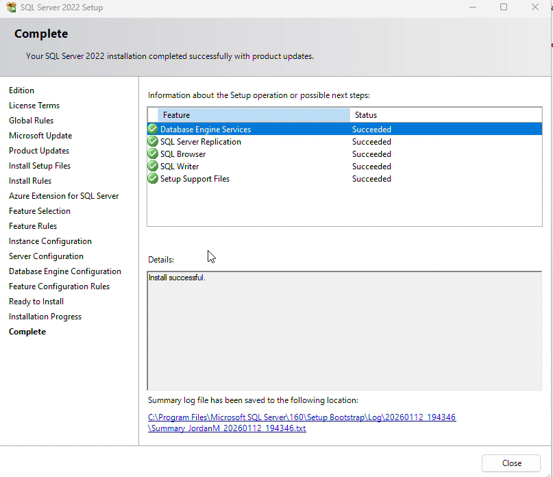

Ahora regresaremos a la ventana en el apartado de `Installation` y ahora buscaremos la tercera donde dice `Install SQL Management Tools` le daemos click y nos llevara en nuestro buscador en Pgina de windows y selecionaremos el boton asul que aparece ahi 

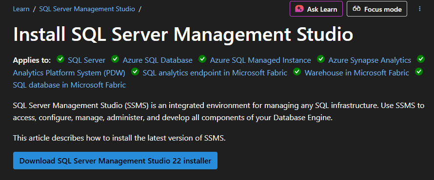

Ya que se descargo empezaremos a ejecutar y nos aparecera una ventana en el cual nosotros le daremos `Continuar` y empezara a istalar `Visual Studio Installer` 

Despues de acabar de intalar correcatamente aparecera una ventana en el cual cual nos dara la oportunidad de intalar paquetes adicionales pero en nuestro caso no caso no instaaremos ninguno asi que le daremos intalar

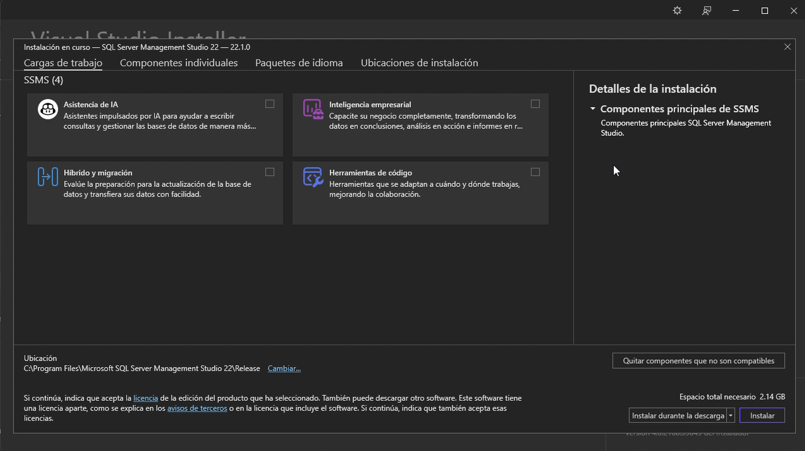

Despues de que termine de descargar prodremos ocupar SQL Management

