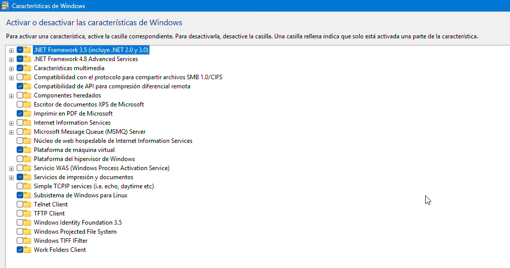
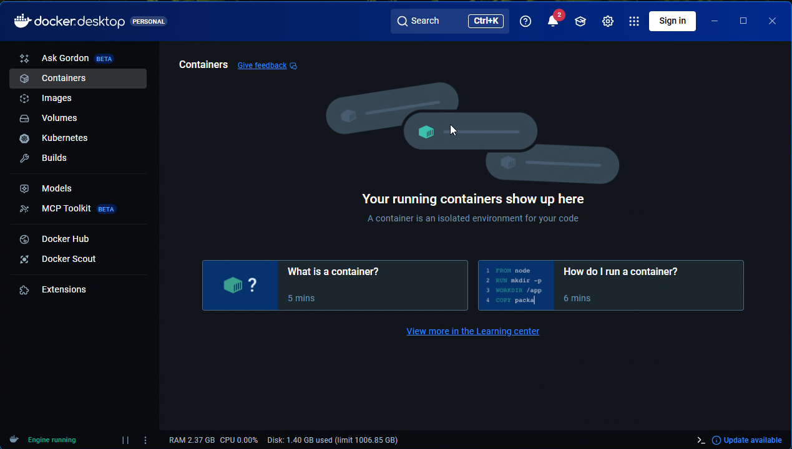
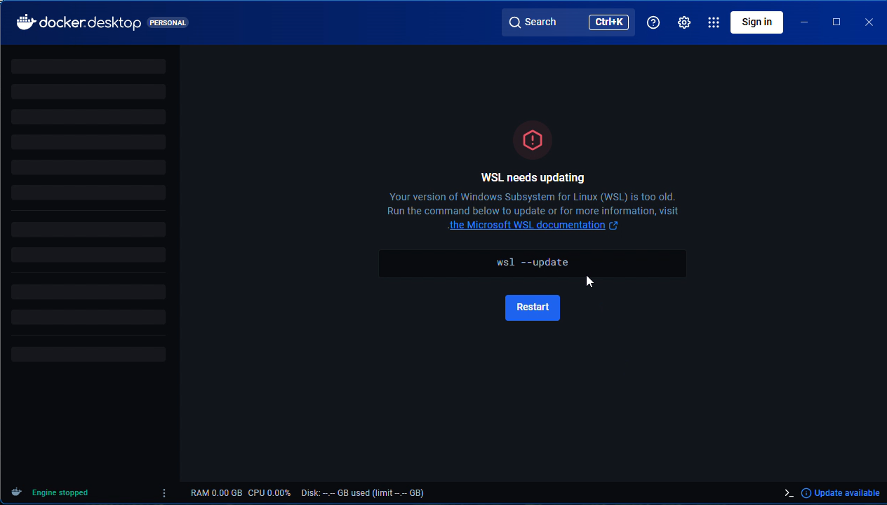
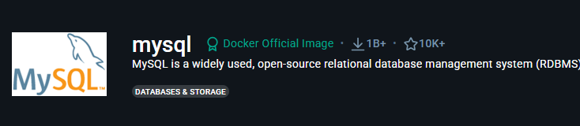
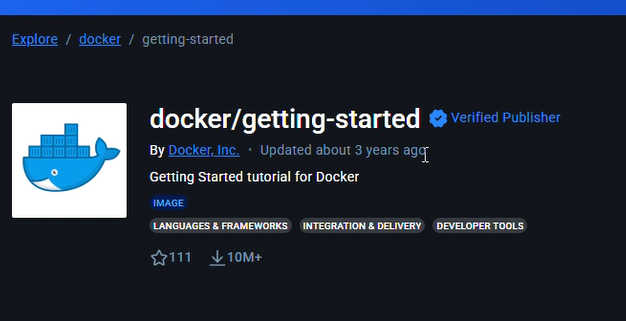

# Instalacionde Docker  

En este markdown mostrearemos los pasos a paso de la intalacion correcta de Docker asi como la configuracion y sus primeros pasos en docker

Antes de descargar docker deberemos que hacer ajustes en nuestro computo para que tenga un buen funcionamieto 

en el Menu de Windows en su buscador deberemos lo siguiente `Activar o Desactivar las caracteristicas de Windows` ya que aqui activaremos una funcion importante, ya dandole click nos aprecera lo siguiente 



Estando aqui buscaremos la opcion `Subsitema de Windows para Linux`, despues de activar esta funcion deberemos que Reiniar el computo par que sea haga la configuracion correctamente

En caso de que ya este cativa no es necesario que reinice nuestra computadora 

Ya echo esto ahora debemos que instalar dcoker en esta vez deberemos que ejecutar como administrador nuestro instalador de  Docker esperamos que lo descargue rapido , ahora lo abriremos y nso aparecera esta ventana 


Aqui deberemos que darle `Aceptar` , por el momento no nos crearemos una cuenta, le daremos skip todo hasta que aparesca esta ventana 



En caso que todo hecho lo anterior les llega a aprecer como en la siguiente imagen, solo hay que darle `Restart` esto ara que se instale y/o actualice el `Subsitema de Windos para Linux`



Y ya esperamos a que que se actualize y nos aparecera el inicio de Docker y para saber que estamos bien podemos ejecutar el siguiente comando en `git bash`  

```git bash
docekr --version
```
esta nos enviara la version de Docker que hemos instalado y si sale la version entonces podemos decir que si se instalo correctamente 


Ahora para que nuestro computo windows funcione de manera correcta con docker deberemos ir a nustro buscador y escribir lo siguiente [imagen docker para sql server](https://learn.microsoft.com/es-es/sql/linux/quickstart-install-connect-docker?view=sql-server-ver17&tabs=cli&pivots=cs1-bash), buscaremos `SQL Server 2019`  y le daremos click esta nos enviara a otra pagina en el cual debemos copiar la Imagen Docker para SQL

Si se preguntan por que se les dice imagen pues es una plantilla ejecutable, liviana e inmutable (de solo lectura) que contiene todo lo necesario para ejecutar una aplicación

En tonces es lo que va hacer Docker con la imagen de SQL Server, va a leer la informacion y verificar para que Docker pueda trabajar con SQL Server sin ningun problema y sin que ocupe memoria de nuestra computadora

si checamos antes de instalar la imagen SQL con este comando nos daremos cuenta que no tenemos ninguna imagen 

###### Imagenes Docker
``` git bash
docker images
```
Ahora si podemos ocupar el siguiente comando para poder instalar la imagen SQL para docker 

``` git bash
docker pull mcr.microsoft.com/mssql/server:2019-latest
```
Esperaremos a que docker descargue todo los archivo 

`Punto importante todo esto se debe realizar mientras docker esat abierto si no te va a dar error`

Ahora ya que tenemos nuestra primera imagen instalada ahora instalaremos otras dos que seran de gran ayuda en momentos de crear base de datos 

A si que iremos a la pagina [Docker hub](https://hub.docker.com/) y en su buscador escribiremos `mysql` 



y ese es que debemos que instalar con el siguiente codigo

``` git bash
docker pull:latest
```
Este nos instalara la ultima version de mysql asi que esperaremo las instalacion 

Ahora buscaremos `docker/getting-started` esto nos servira para introducirnos al mundo Docker d eun forma practica, enseñandonos a empaquetar, distribuir y ejecutar aplicaiones en contenedores para lograr entornos de desarrollo consistentes, portabilidad entre maquinas y despliegue mas rapido

En pocas palabras esto nos sirve para que no haya el tipico problema de mi maquina si funciona y en la otra no



Ya estando ahi en la pagina buscaremos el siguiente codigo, lo pndremos en el git bash y esperaremos a que se haga la descarga

``` git bash
docker pull docker/getting-started 
```
para checar que si hayan instalado las imagenes procedemos a poner el codigo [Doker Imagenes](#imagenes-docker) y si aparecen tres es por que lo hemos echo bien hasta el Momento 

## Creacion de Contenedores

En esta parte podremos ver que distintas manera podemos crear Contenedores desde la mas cencilla hasta la mas compleja , como tambien comandos en el cual nos serviran como para revisar nuestro contenedores activos y desactivados 

### Correr una imagen 

``` git bash
docker run -d -p 80:80 docker/getting-started 
```
Este nos sirve para hcer prueba con una imagen con docker donde `docker run` sirve para que cree y ejecute un contenedor a partir de una imagen, `-d` Ejecuta el contenedor en segundo plano (no bloquea la terminal), `-p 80:80` Hace un mapeo de puertos en este caso del puerto de tu computadora al puerto del contenedor y ya por ultimo `getting-started` es el nombre de nuestro puerto 

Esto seria la manera mas completa de levantar un contenedor ninguno es mas importante que otro , todos son escenciales para el buen funcionamiento de un contenedor

`Ejemplo `

En un caso podemos que cupemos el siguiente comando, solo vamos a ejecutar el contenedor pero no nos dejara ocupar el `git bash` y que si queremos ocupar un contenedor para guradr este no nos dejar por que estara bloqueada la terminal del docker y aparte de esto se creara por un nombre de contenedor por default 

```git bash
doker run d793
```

### Identificar contenedores

Para saber que contnenedores por medio de Git bash son dos muy parecidos y el tercero cambia 

``` Git bash
docker ls 
```
``` Git bash
docker ls -a
```
``` git bash
docker ps
```

Los dos sirven pero en caso del primero solo funciona con los que estan activos o los que estan en uso y el segundo es para mostrar todos los contenedores que hay sin que esten esten activos y por tercero es un comando que te devuelve con uan tabla que da con informacion pero este es mas detallado 


### Inicio o Pusa de un contenedor

Solo hay dos comandos que hacen esto que son los siguientes 

```git bash
docker start f285
```
``` git bash
docker stop f285
```
 El primer comadno se ocupa para activar el contnedor y el segundo es para parar el contenedor , este caso la parte de `f285` son los primero 4 diguitos del ID del contenedor pero tambien podemos ocupar el nombre del contenedor 

 ### Crear o eliminar un contenedor

 ```git bash
 docker run
 ```
 ``` git bash
 docker rm
 ```
 ``` git bash
 docker rm -f
 ```

Estos tres comandos sirven para crear o eliminar contenedores el primero es para iniciar uno nuevo , para elimar son dos manera con `rm` es para cuando el contenedor esta pausado y el `rm -f` es para cuando el contenedor es para eliminado forzosamente aun cuando este este trabajando 


### USO PROFECIONAL DE DOCKER CON SQL SERVER

En este caso existen do maneras de e podamos ocupar sql server con ayuda de Doker solo que exiten dos tipos `sin Volumene` y `con Volumen`
a continuacion habra dos ejemplos 

##### Sin volumen
``` shell
docker run -e "ACCEPT_EULA=Y" -e "MSSQL_SA_PASSWORD=P@ssw0rd" \
   -p 1435:1433 --name servidorsqlserver \
   -d \
   mcr.microsoft.com/mssql/server:2019-latest
```

#### Con volumen
``` shell
docker run -e "ACCEPT_EULA=Y" -e "MSSQL_SA_PASSWORD=P@ssw0rd" \
   -p 1435:1433 --name servidorsqlserver \
   -v volume-mssqlevnd:/var/opt/mssql \
   -d \
   mcr.microsoft.com/mssql/server:2019-latest
````
La diferencia es en esta linea de codigo `-v volume-mssqlevnd:/var/opt/mssql \` ya que esta linea hace que haya volumen 

El uso de volúmenes en contenedores de SQL Server es fundamental cuando se requiere conservar información. Mientras que los contenedores sin volumen son útiles para pruebas temporales, los contenedores con volumen ofrecen mayor seguridad y estabilidad, siendo la opción más recomendable para proyectos reales.

| Característica        | Sin volumen | Con volumen             |
| --------------------- | ----------- | ----------------------- |
| Persistencia de datos | ❌ No        | ✅ Sí                    |
| Riesgo de pérdida     | Alto        | Bajo                    |
| Uso recomendado       | Pruebas     | Desarrollo / Producción |
| Facilidad             | Muy alta    | Alta                    |


### Como Iniciar SQL SERVER con contenedor de Docker

Ya echo lo anterior ya que creamos nuestro contenedro y aver repado los comandos encenciales ahora se mostrar de como usar SQL Server iniciamos con SQL Servwe en para empezar aocupar la base de datos 


Este es el menu de inicio de una base de datos con slq server aqui debemos que poner lo necesario en este caso debemos que  poner el `nombre del servidor` o tambien podemos po0ner lso cuatro primero numeros del servidor en este caso com el ejemplo que ocupamos arriba en [los servidores con volumen](#con-volumen) que seria el siguiente numero `.,1435`

Dejamos la auntenticacion como este que es por SQL Server Nombre del usuari ocumaso que seria `sa` que es lo que pusimos lo siguiente "MSSQL_SA_PASSWORD=P@ssw0rd" , ya la contraseña es la que pusimos que seria lo que biene ene el nombre del usuario del ultimo codigo y ya por ultimo en cifrar seria en opcional ya echo lo anterio ya podemos ya podemos conectar asi que ya se creara  la base de datos con un nombre, una contraseña, con un contenedor en caso de que eliminemos la base de datos por error y tambien con vlumen ya que para que pueda saver con que tipo de base de datos podramos trabajar
