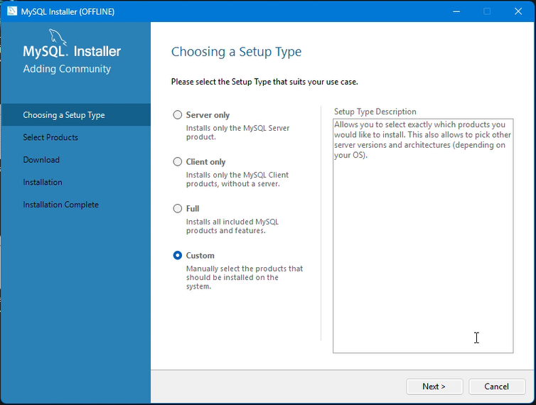
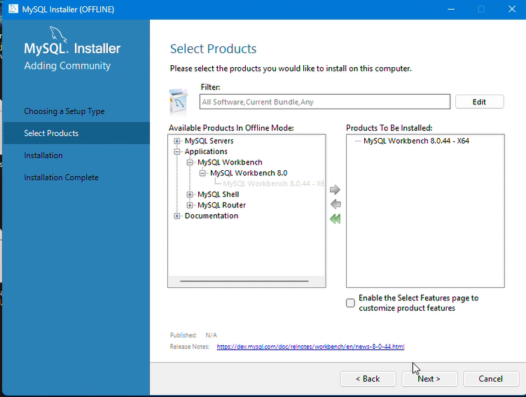
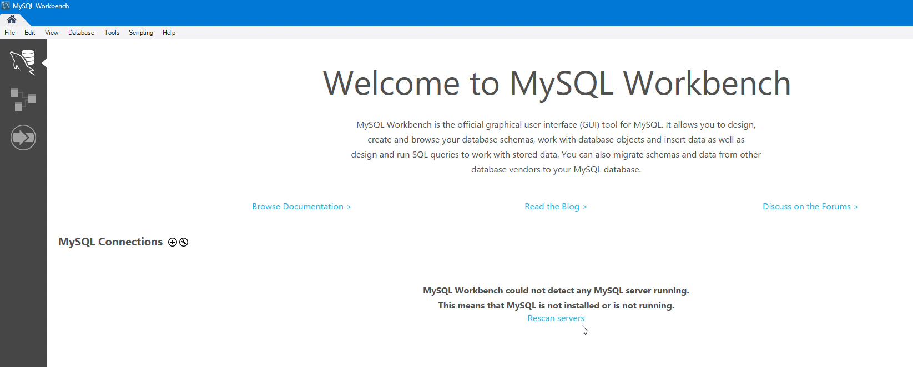
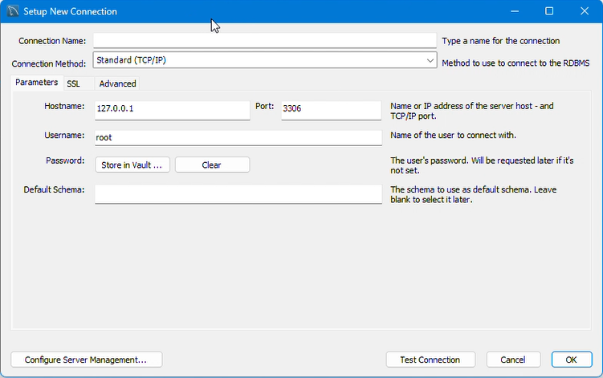
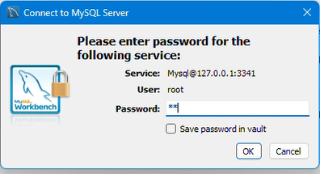
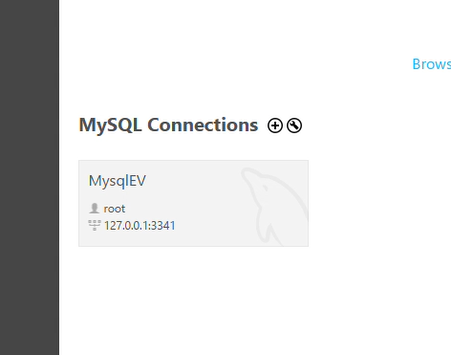

# Instalacion de MYSQL Workbench

En este markdown enseñaremos el paso a paso de como debemos que instaalar `MYSQL Workbench` y tambien los primero pasos de uso ya que varia un poco con el Software de [SQL Management](02_InstalaciondeSQLManagement.md) que se instalo previamente

Para descargar el Sofware deberemos que ir a la pagina de este mismo que se encuentra que podra encontrar con lo darle click [aqui](https://www.mysql.com/products/workbench/).

Ya descargado esto ahora debemos que empezar a instalarlo siguiendo los siguientes puntos e imagenes que se muestra a continuacion

Abierto el pprograma nos encontraremos con esto asi que le daremos que si 


Acontinuacion nos aprecera la siguente ventana en el cual le daremos la ultima opcion `Coustom`


En esta parte la instalacion deberemos que hacer lo siguiente que es desplegar la opcion `Aplicacion` >>> `MySQLWorkbench` >>> `MySQLWorkbench 8.0` y ahi encontraremos la version que ocuparemos en el cual selecionaremos y acontinuacion le daremos clik a la flecha que esta dirijida hacia la izquierda que esta en emdio de los cuadrados para indicar que ese paquete queremos instalar, le daremos siguiente y despues ejecutar parqa que inicie la descarga del apqeute que vamos a cupar


Ya descargado nos abrira la aplicaion y aparecera asi como se encuentra en la imagen de abajo 


## Primeros pasos con MySQL Workbench

Deberemos que crear un volumen para respaldar nuestro trabajo, tambien crear un repositorio asi tambien como un puerto para saver de donde sale y adonde se va conectar , asi mismo vamos a poner lo quees un nombre al volumen y al reporcitorio y una contraseña en el cual nos ayudara mantener segura nuestro trabajo en als base de datos con ala que trabajemos, asi como se muestra en el ejemplo de abajo

``` shell
docekr run --name mysqlev -p 3341:3306 -v vol-mysqlev-:/var/lib/mysql -e  MYSQL_ROOT_PASSWORD=1234 -d mysql
```
Ahora seguiremos la conexion de la creadcion del repositorio a MySQL deberemos dar click en en el boton de signo `mas` y ahora podemos nos saldra la siguiente ventana



Llenaremos los campos que son necesarios para conectar con el servidor
Ya echo lo anterior deberemos que dar click en Test conection para poder verificar que hemos llenado bien los campos e ingresar la contraseña que hemos puesto con anterioridad al crear nuestro repositorio yb el volumen den Docker



Para finalizar deberemos que darle `OK` a las dos ventanas para poder ver nustras conexiones de MySQL como se muestra en la imagen de abajo 



Ya podremos entrar sin ningun problema anuestra mesa de trabajo de MySQL Workbench


